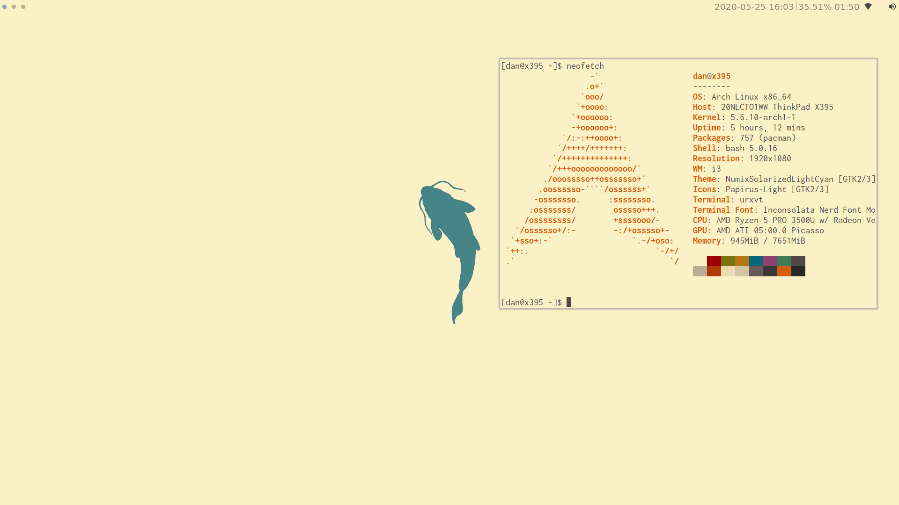
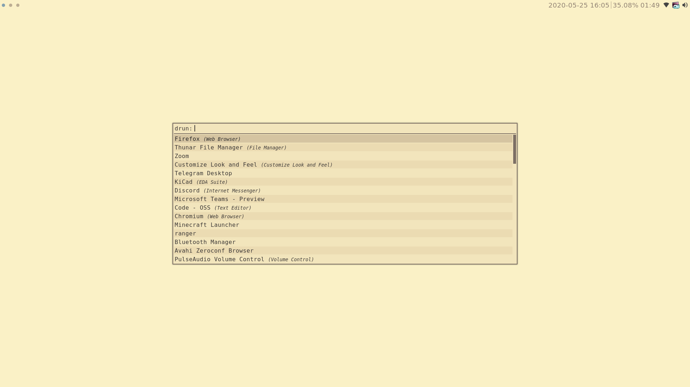
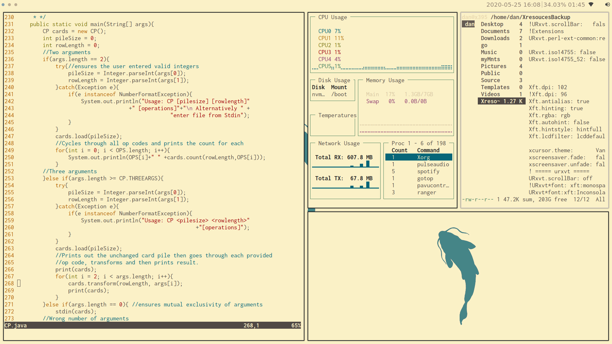

# Rice 
My Personal rice files

## Required packages
    I3gaps
    Rofi 
    Feh
    Volumeicon
    Network-manager-applet
    tryone-compton-git(AUR)
    i3lock-fancy-git(AUR)
    URxvt-resize-font-git
## GTK and Fonts 
    Nerd-fonts-inconsolata 
    Arc gtk theme
    papirus icon theme    
## Optional Extras
    lxapperence
    Pavucontrol 
    spotify-dev 
    redshift

## Grub Config
Used matter grub theme from 
https://github.com/mateosss/matter
## Known problems 
Urxvrt does not display font awesome incons:
    Termite can be used as intermediary terminal  

xbaclight does not work on amd
    Installed blight and updated i3cfg for amd systems
# Screenshots

